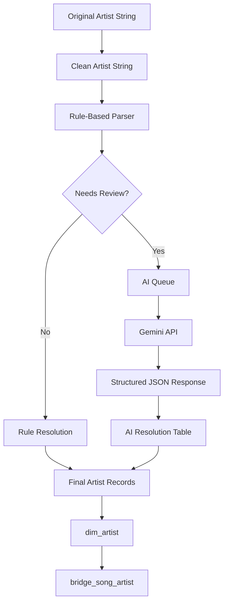

## Artist Entity Resolution

```mermaid
flowchart TD

    A[Original Artist String]
        --> B[Clean Artist String]

    B --> C[Rule-Based Parser]

    C --> D{Needs Review?}

    D -->|No| E[Rule Resolution]
    D -->|Yes| F[AI Queue]

    F --> G[Gemini API]

    G --> H[Structured JSON Response]

    H --> I[AI Resolution Table]

    E --> J[Final Artist Records]
    I --> J

    J --> K[dim_artist]
    K --> L[bridge_song_artist]
```